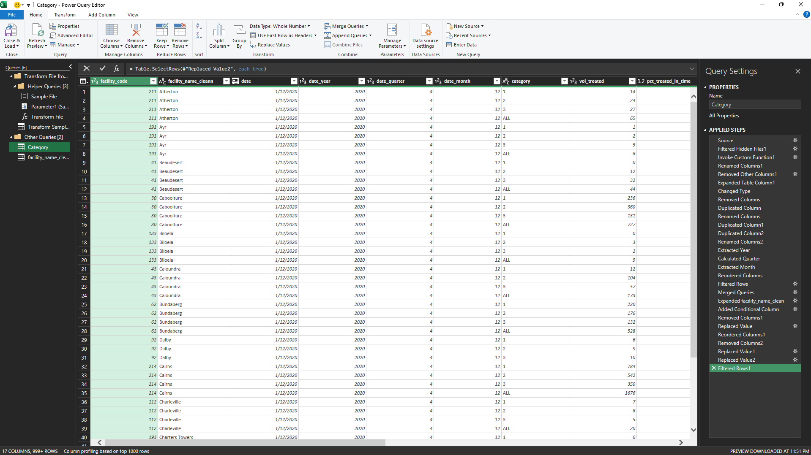
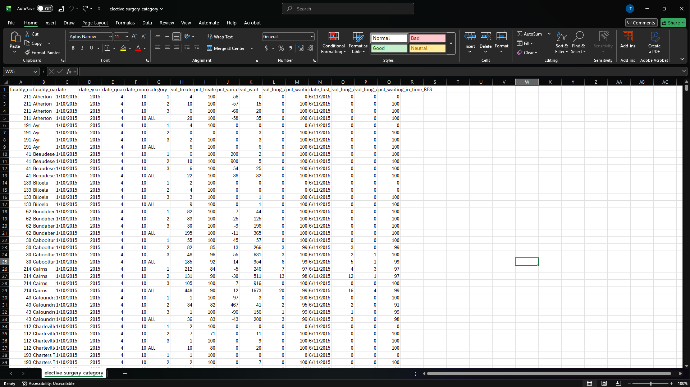
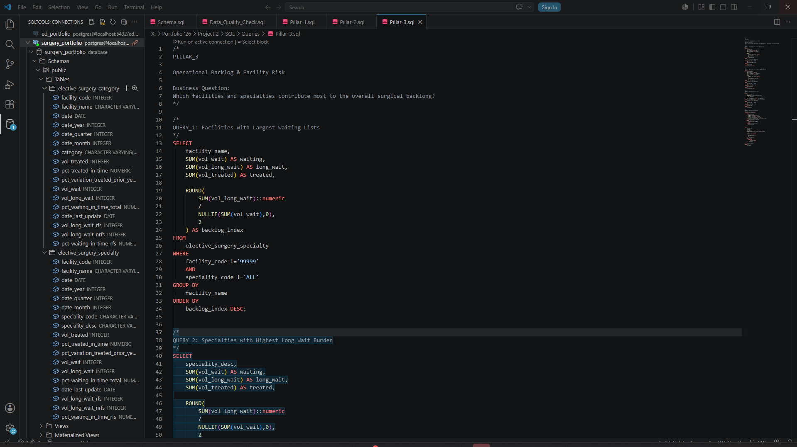
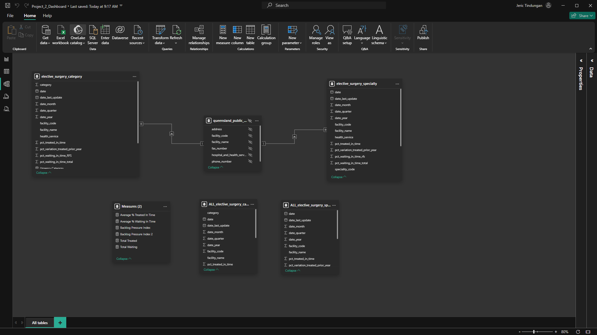
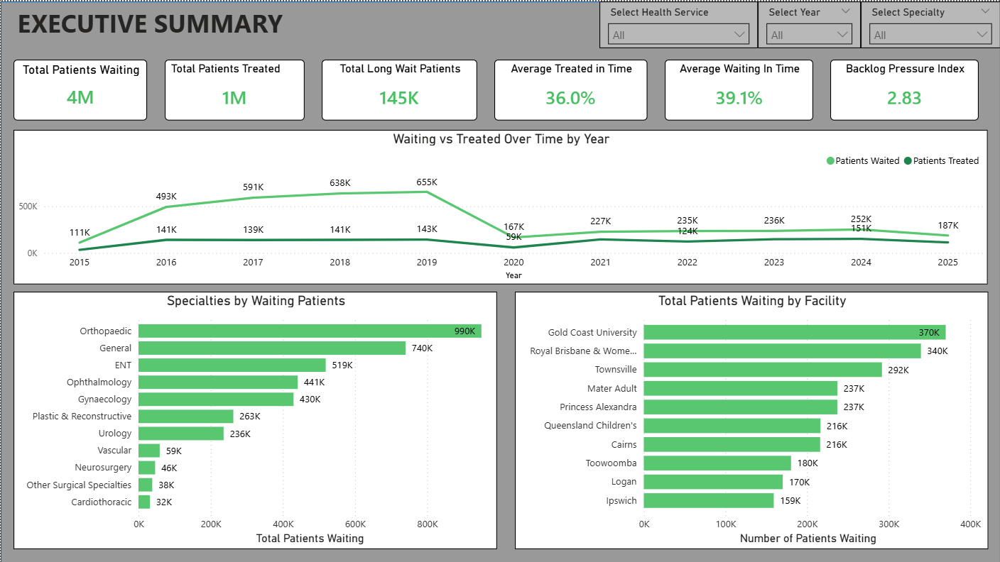
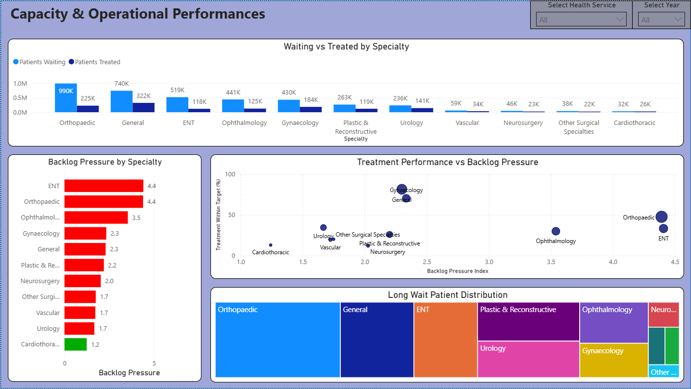
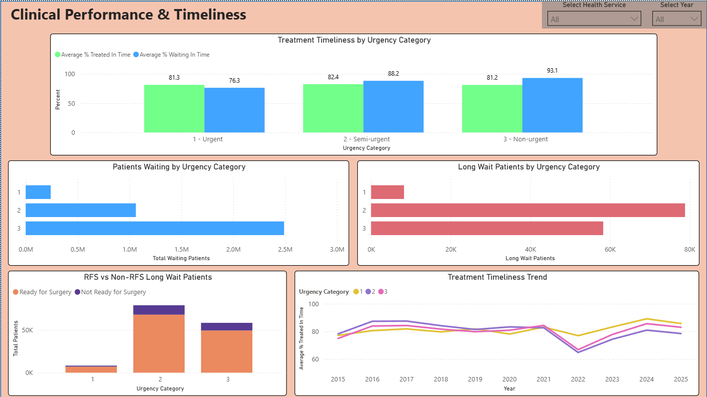

# 🏥 Queensland Elective Surgery Performance Analytics

An end-to-end healthcare analytics project using **PostgreSQL**, **Power BI**, **Power Query**, and **DAX** to analyse Queensland elective surgery demand, treatment timeliness, waiting list performance, and operational backlog across Queensland public hospitals between **2015 and 2025**.


---

# 📖 Project Overview

Queensland Health publishes statewide elective surgery performance data to monitor patient demand, treatment timeliness, and operational capacity across public hospitals.

This project transforms raw public datasets into an interactive business intelligence solution by applying an end-to-end analytics workflow involving data preparation, SQL analysis, data modelling, and dashboard development.

The final Power BI dashboard provides executives with an intuitive way to monitor elective surgery demand, identify specialties experiencing operational pressure, evaluate treatment performance, and explore waiting list trends across Queensland Health facilities.

---

# 🎯 Business Problem

Healthcare organisations require timely insights into elective surgery performance to ensure patients receive treatment within clinically recommended timeframes while maintaining sustainable waiting lists.

This project answers several key business questions:

- Which specialties have the largest waiting lists?
- Which facilities experience the greatest operational backlog?
- Are patients being treated within recommended timeframes?
- Which urgency categories contribute most to long waiting lists?
- How has elective surgery demand changed over time?

---

# 📂 Dataset

**Source:** Queensland Government Open Data Portal

Datasets used:

- Elective Surgery by Clinical Specialty
- Elective Surgery by Urgency Category

Reporting period:

**October 2015 – September 2025**

---

# 🔄 Project Workflow

## 1. Data Preparation

Raw datasets were imported into **Power Query**, where data quality issues were addressed before loading into PostgreSQL.

Tasks included:

- Removing duplicate and unnecessary columns
- Creating Year, Quarter and Month fields
- Standardising facility names
- Building Health Service lookup tables
- Preparing clean analytical datasets



---

## 2. Clean Dataset

Following transformation, clean datasets were prepared for SQL analysis.



---

## 3. SQL Analysis

SQL analysis was organised into three analytical pillars.

### Pillar 1 — Statewide Demand & Capacity

- Patient waiting volumes
- Treatment activity
- Facility performance
- Trend analysis

### Pillar 2 — Treatment Performance

- Percentage treated within recommended time
- Percentage waiting within recommended time
- Urgency category performance
- Clinical timeliness

### Pillar 3 — Operational Backlog

- Long wait patients
- Facility backlog
- Specialty backlog
- Custom Backlog Pressure Index

Additional SQL scripts included:

- Data Quality Checks
- Executive KPI calculations



---

## 4. Power BI Data Model

The final dashboard was developed using a relational data model linking specialty and urgency datasets through a hospital reference table.

Separate statewide tables were created to support executive KPI reporting while maintaining interactive filtering across specialty and facility analyses.



---

# 📊 Dashboard

## Executive Summary

Provides a statewide overview of elective surgery performance including:

- Total Patients Waiting
- Total Patients Treated
- Long Wait Patients
- Average Treatment Performance
- Backlog Pressure Index
- Waiting list trends
- Highest demand specialties
- Highest demand facilities



---

## Capacity & Operational Performance

Focuses on specialty-level operational demand.

Visualisations include:

- Waiting vs Treated by Specialty
- Backlog Pressure by Specialty
- Treatment Performance vs Backlog Pressure
- Long Wait Patient Distribution



---

## Clinical Performance & Timeliness

Examines treatment performance by urgency category.

Visualisations include:

- Treatment Timeliness
- Patients Waiting by Urgency
- Long Wait Patients
- Ready vs Not Ready for Surgery
- Treatment Timeliness Trend



---

# 💡 Key Insights

- Orthopaedic Surgery consistently maintained the largest statewide waiting list.
- ENT and Orthopaedic Surgery recorded the highest Backlog Pressure Index values.
- Category 2 and Category 3 patients contributed most to long waiting lists.
- Treatment performance varied considerably between urgency categories.
- Interactive filtering enables users to investigate trends by Health Service, Year, Facility, and Specialty.

---

# 🛠 Technologies Used

- PostgreSQL
- SQL
- Power BI
- Power Query
- DAX
- Microsoft Excel
- Git
- GitHub

---

# 📁 Repository Structure

```
elective-surgery-performance-analytics
│
├── data/
├── documentation/
├── images/
├── powerbi/
├── sql/
└── README.md
```

---

# 📚 Skills Demonstrated

- Data Cleaning
- Data Transformation
- SQL Query Development
- Relational Data Modelling
- Healthcare Analytics
- Business Intelligence
- Dashboard Design
- DAX Measures
- Executive Reporting
- Data Storytelling

---

# 🚀 Future Improvements

Potential future enhancements include:

- Predictive modelling for elective surgery demand
- Automated dashboard refresh using live datasets
- Facility-level drill-through reporting
- Additional operational KPIs and benchmarking
- Performance forecasting using time series analysis

---

# 👨‍💻 Author

**Gem Tin**

Registered Nurse transitioning into Clinical Data Analytics.

This project was completed as part of my healthcare analytics portfolio, demonstrating end-to-end data analysis using SQL and Power BI.
